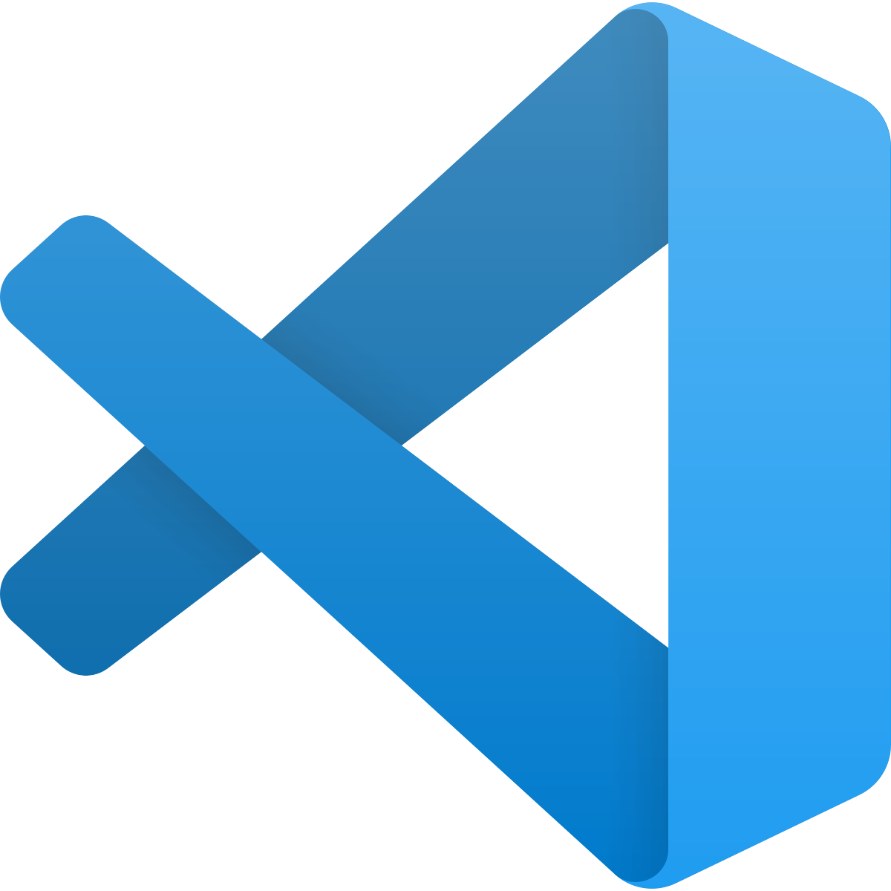
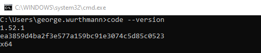
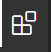
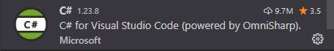
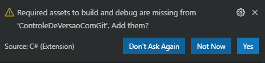
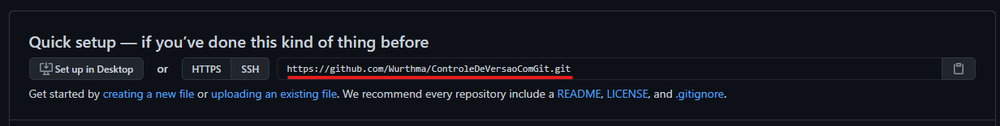
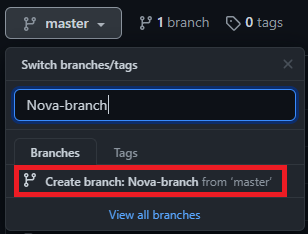

### Como usar VS Code, git e github

Este exercício irá te preparar para usar o VS Code junto com git para desenvolver nossos projetos práticos e subir para seu repositório no github.

## Visual Studio Code (Vs Code):



Se você já teve contato com alguma linguagem de programação é muito provável que já usou o VS Code.

Ele que iremos utilizar para desenvolver os exercícios, então seu primeiro passo será baixa-lo e instalar a extensão do C#, siga os passos abaixo.

#### Passos para instalação VS Code:

1. Baixe o VS Code pelo link: https://code.visualstudio.com/
2. O VS Code possui um CLI, não  abordaremos com detalhes, mas para testar a instalação, abra um software de linha de comando e digite `code --version` para verificar a versão instalada.

    

3. Após instalado, clique no botão de extensões do VS Code:

    

3. Localize a extensão do C# e faça a instalação.
    
    

## Git

Git é um software de controle de versão. Pense nele como um repositório onde você "guardará" seus projetos e controlará as alterações feitas nele.
Neste ponto você aprenderá os comandos básicos de git para fazer o controle de alterações do seu projeto.

Para seguir com os exemplos práticos de git, baixe-o no link: https://git-scm.com/downloads 

Após instalação do git, use o comando abaixo no terminal para verificar se o mesmo foi instalado corretamente:
`git --version`

Antes de usá-lo é necessário configurar um nome de usuário e um e-mail usando os comandos abaixo no terminal:
`git config --global user.name "Seu Nome"`
`git config --global user.email "seu_email@example.com"`

#### Criando seu primeiro projeto com git

Criaremos um projeto simples em C# e faremos o controle de versão desse projeto usando Git, siga os passos abaixo para criar um projeto console em C#.

1. Crie no repositório de sua escolha um projeto com o nome "ControleDeVersaoComGit":
     `dotnet new console -o ControleDeVersaoComGit`

2. Acesse a pasta do projeto criado acima com o comando `cd ControleDeVersaoComGit`
3. Por fim, abra o projeto no VS code usando o comando `code .`, se preferir, pode usar o próprio VS Code para abrir a pasta do projeto no menu **File > Open Folder...**
4. Quando a mensagem abaixo for exibida, clique em sim.

    

5. Não faremos nenhuma alteração nesse projeto por enquanto, nosso objetivo é controlar a versão dele, o primeiro comando que iremos aprender é o `git status`. Estando com o repositório desse projeto aberto no VS Code pressione o atalho `Control + '` para abrir o terminal e digite o comando `git status` (você pode realizar os comando de qualquer terminal, se preferir utilize outro de sua escolha).
    Você receberá uma mensagem de erro: fatal: not a git repository (or any of the parent directories): .git
    Isso ocorre por que não iniciamos nosso projeto do git.
6. Para iniciar o git nesse projeto use o comando `git init`. Será possível ver agora no Source Control do VS Code uma notificação que indica a quantidade de arquivos modificados ou alterados do projeto. Como iniciamos o git agora no projeto, todos arquivos dele serão notificados.

    

#### Configurando o .gitignore

Usando git é importante sempre configurarmos o arquivo **.gitignore** do nosso projeto antes do primeiro commit (que será explicado na próxima etapa). Esse arquivo informa quais arquivos o git pode ignorar do projeto, pois, quando estamos trabalhando em um projeto de software, muitos arquivos são apenas temporários, gerados durante a compilação ou logs e não precisam ser controlados pelo git.

###### Siga os passos abaixo para criarmos um gitignore para nosso projeto:

O próprio CLI do dotnet gera o arquivo .gitignore com os principais arquivos de um projeto dotnet a serem ignorados. Para isso basta executar o comando abaixo na pasta do projeto:

`dotnet new gitignore`

Ou, se preferir, pode cria-lo manualmente seguindo os passos abaixo:

1. Pelo "Explorer" do VS Code crie um arquivo na raiz do nosso projeto "ControleDeVersaoComGit" com o nome .gitignore
2. Coloque os arquivos e pastas que deseja ignorar dentro do arquivo criado e salve-o.

Após a criação do .gitignore você terá menos arquivos na notificação do "Source Control".


#### Commit

Um **commit** grava as alterações feitas no projeto. Antes de realizar o commit, procure sempre revisar tudo que você alterou antes, para garantir que você não alterou nada que comprometa o funcionamento da sua aplicação.
Nosso projeto não teve nenhuma alteração, mas antes de subir vamos realizar um `dotnet run` para verificar se nossa aplicação está funcionando normalmente:


Após garantir que sua aplicação está funcionando, siga os passos abaixo para fazer o nosso primeiro commit:

1. Use o comando `git status` para vermos a situação atual do nosso repositório. Tente entender o retorno do git.
    Note que o git mostra os arquivos que não estão sendo ainda rastreados por ele, esses arquivos precisam ser adicionados ao git, como ele mesmo informa.
2. Para adicionar todos os arquivos listados use o comando `git add .`
3. Use novamente o comando `git status` e agora podemos ver os arquivos que foram adicionados ao git.
4. Use o comando `git commit -m "Meu primeiro commit"` para confirmar as alterações do projeto com uma mensagem simples do que fizemos nesse commit.
5. Se rodarmos novamente o `git status` veremos que não temos mais modificações no projeto. E no "Source Control" do VS Code também não temos mais alterações notificadas.
6. Modifique o arquivo "Program.cs" do seu projeto, vamos adicionar uma linha nova a ele imprimindo a data de hoje. A linha deve ficar abaixo do "Hello World!":
	```csharp
	Console.WriteLine(DateTime.Now.ToLongDateString());
	```
7. Após salvar o arquivo alterado você poderá ver que o VS Code notificará a alteração no "Source Control", vamos conferir também pelo `git status`.
    Veremos a mensagem: **modified:   Program.cs**
8. Vamos realizar novamente os passos para "commitar" nossa alteração ao projeto. Primeiro o `git add .`, para adicionar todos arquivos novos ou alterados.
9. Por fim, o commit da alteração: `git commit -m "Adicionado comando para imprimir a data de hoje."`

## Github

Git e github não são a mesma coisa. O github.com é um site onde podemos subir nossos repositórios para a nuvem. Isso pode ser feito pelos comandos do git.
Configuraremos o projeto que criamos acima para subirmos para um repositório no github.

Antes de seguir os passos baixo, crie uma conta no github.com, se ainda não tiver uma e siga os passos abaixo:

1. Crie um repositório em Repositories > New
2. Coloque o nome "ControleDeVersaoComGit"
3. Coloque a descrição que achar mais adequada, deixe o repositório como público e deixe o restante das opções desmarcadas.

#### Push

Para subirmos o nosso projeto para o github, no repositório que acabamos de criar, utilizaremos o comando `git push`, mas antes utilizaremos os comandos abaixo pra configura-lo:

1. git remote add ControleDeVersaoComGit <url>
    A url você pode pegar assim que criar seu repositório, será algo parecido com o exemplo grifado na imagem abaixo:
    

2. Agora vamos realizar o push: `git push --set-upstream ControleDeVersaoComGit main`
    O comando acima indica que estamos fazendo um push para o repositório com nome "ControleDeVersaoComGit" na branch "main"

3. Atualize seu repositório no github e poderá ver agora todos os arquivos que estavam até então apenas na máquina local.

Para praticar, vamos realizar mais uma alteração:

1. Inclua a linha abaixo logo depois da linha que imprime a data de hoje:
    ```csharp
	Console.WriteLine("Versão da aplicação: 1.0");
	```

2. Teste sua aplicação e depois use o comando `git add .` para adicionar a alteração (Se quiser observar o que está sendo alterado, lembre-se de usar o `git status`).
3. Use o comando `git commit -m "Adicionada linha com versão da aplicação."` para fazer o commit da alteração.
4. Como já fizemos a configuração você pode usar agora apenas o comando `git push`.
5. Atualize seu repositório no github e você poderá observar as alterações. Entre também no histórico do seu repositório no github e você visualizará todos seus commits. Navegue pelo histórico e tente entendê-lo.

#### Pull

Com o comando `git pull` você pode atualizar seu projeto local com alterações realizadas por outros desenvolvedores.

#### Clonando projetos existentes

No nosso exemplo, criamos um projeto do zero fizemos o controle de versão com o git e colocamos em um repositório na nuvem usando o github. Mas e se quisermos usar um projeto já existente?
Para esse exemplo vamos clonar um repositório simples do meu perfil do github. Mas o passo a passo serve para qualquer repositório público. Se preferir crie um repositório novo pelo seu github colocando apenas o README.md e depois clone-o seguindo os mesmos passos abaixo:

1. Para clonar um repositório use o comando `git clone <url>` e o mesmo será clonado pro seu repositório atual.
2. A URL pode ser visualizada no github pelo botão "Code" do repositório que deseja clonar. Acesse o [repositório que iremos clonar](https://github.com/Wurthma/HackerHankExercises "repositório que iremos clonar") e tente encontrar a URL. O comando completo ficará assim:
    `git clone https://github.com/Wurthma/HackerHankExercises.git`

3. Acesse a pasta onde fez o clone e você poderá ver o repositório.

#### Branchs

*(Branchs é abordado de forma simplificada, não será necessário para realizar os exercícios)*

Branchs são "ramos" do nosso projeto, usamos elas para ter um melhor controle das alterações que estamos subindo para nossas aplicações.
Você pode criar novas branchs em seus repositórios usando o comando `git branch` ou pelo próprio github:
    

Você pode definir como será a divisão das suas branchs, abaixo segue um exemplo:
- main (Branch principal, onde só serão aplicadas as alterações que já passaram por testes e já podem subir para produção)
- develop (Branch onde todos os desenvolvimentos serão aplicados para posteriormente ir para teste)

#### Merge

*(Merge é abordado de forma simplificada, não será necessário para realizar os exercícios)*

É comum, durante um projeto real, antes de iniciar a alteração, você tirar uma branch sua da develop, e quando você terminar todas as alterações no projeto você faz o "merge" das alterações para a develop. Isso é seguido por todo o time e durante o merge é necessário verificar se houve conflitos (se outros desenvolvedores do time alteraram os mesmos trechos que você alterou).

Existem ferramentas específicas que facilitam a visualização do merge, o próprio VS Code pode ser utilizado para isso. Mas é possível fazê-lo com o comando `git merge`.

Aqui encontramos apenas o básico do git, o suficiente para você seguir com os exercícios. Caso queira aprofundar seus conhecimentos sobre git, acesse sua documentação: https://git-scm.com/doc 
